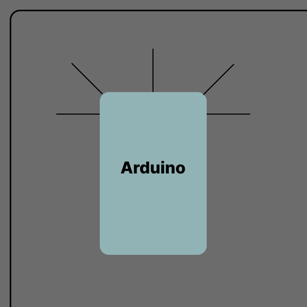

# Arduino Project Linsenpod 
## **Ideen**
### 1. Web controlled Car
- Esp8266
- controlled via Website ? how? -> **fast enough???**
- colorcodes on the floor for special features (horn, lights, ...)
- savety features (Ultrasound sensor)

## **Umsetzung**
### 1. Verbinung von ESP und Browser
### 2. Datentransfer mit Javascript und C++
### 3. Kamera
### 4. Auto (Motor und Servos)
### 5. Ultraschallsensor zur Absicherung
evtl. 3 statt nur 1 (2 bewegliche zur Hinderniserkennung und Anweisung an den Benutzer)

Der Arudino erkennt, dass nur rechts Platz ist und weist den Benutzer darauf hin.
(evtl. nur ein aber dafür schwenkbarer ultraschallsensor(nachteil: langsamer und damit nicht so sicher. Vorteil: weniger bauteile)

###  6. Süßigkeitenpistole mit Zeitintervalen
